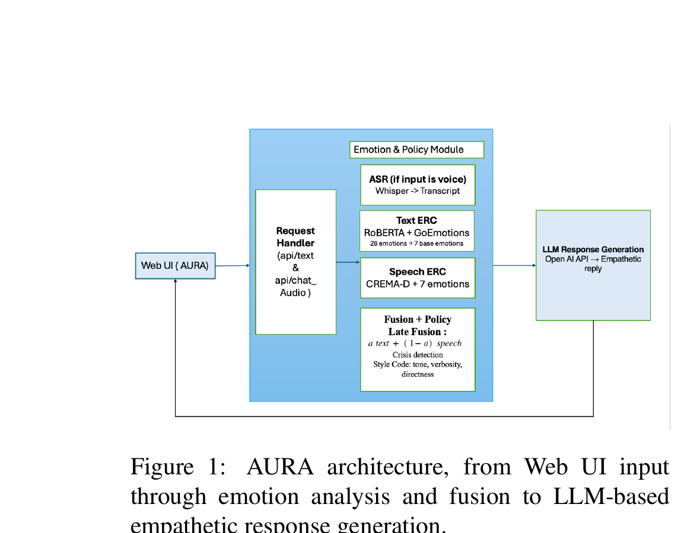
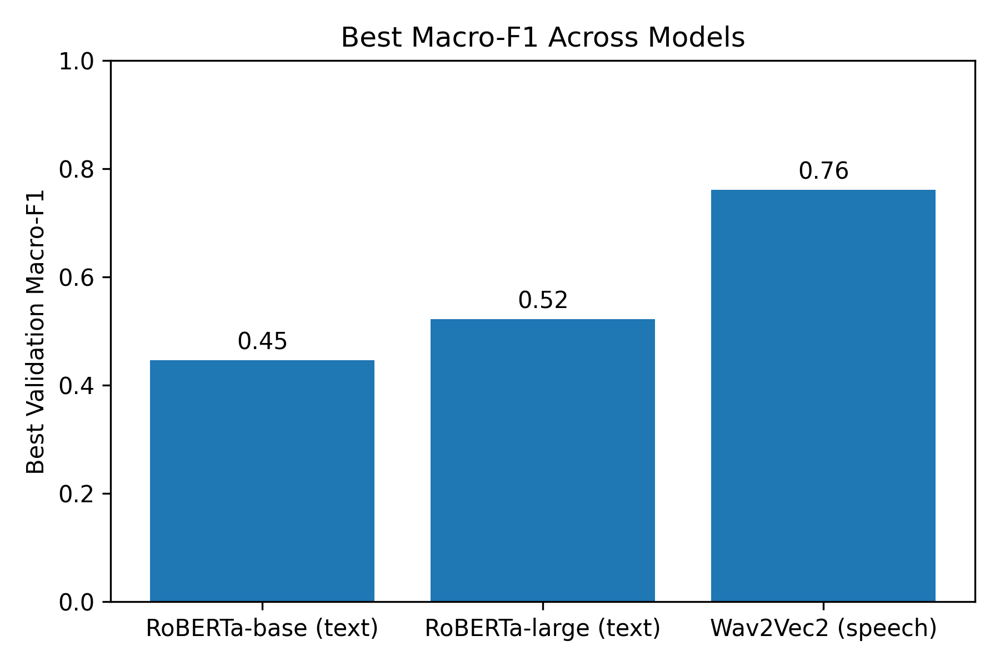
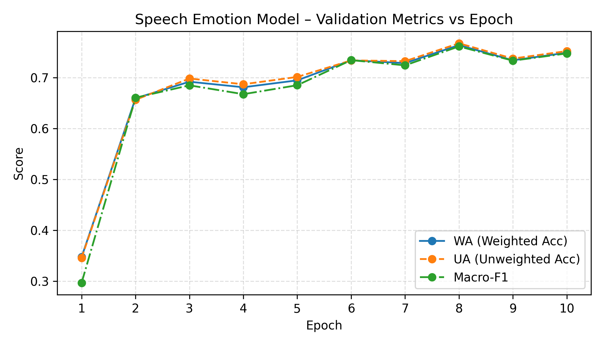
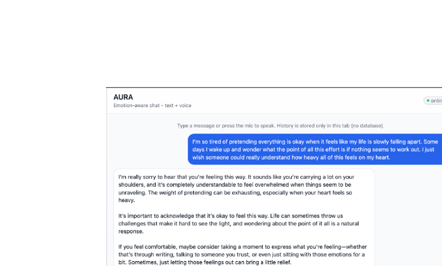
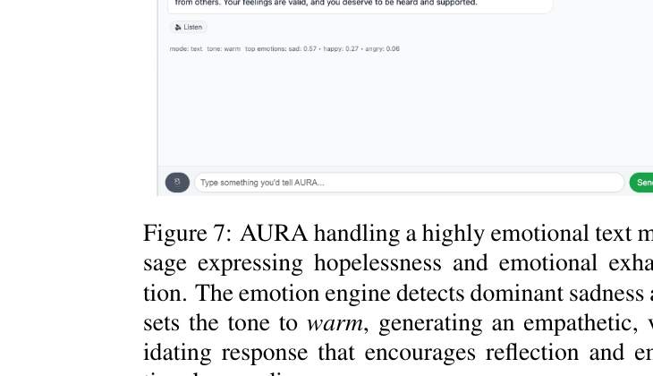

# AURA: Emotion-Aware Multimodal Therapy Chatbot

An emotion-aware multimodal chatbot that combines text and speech emotion recognition with LLM-powered response generation to provide empathetic, context-sensitive therapeutic interactions. Built as a final project for CS 678 (NLP) at George Mason University, Fall 2024.


## Architecture

<p align="center">
  
</p>

*Figure: AURA architecture — from Web UI input through emotion analysis and fusion to LLM-based empathetic response generation.*

**Pipeline Flow:**
```
User Input (Text / Voice)
     │
     ├──▶ ASR (Whisper) ──▶ Transcript     [if voice input]
     │
     ├──▶ Text ERC (RoBERTa + GoEmotions)  ──▶ 28-dim → 7-way emotion probs
     │
     ├──▶ Speech ERC (Wav2Vec2 + CREMA-D)  ──▶ 7-way emotion probs
     │
     ├──▶ Late Fusion: α·text + (1-α)·speech ──▶ Unified 7-way distribution
     │
     ├──▶ Crisis Detection + Style Mapping  ──▶ tone, verbosity, directness
     │
     └──▶ LLM (GPT-4o-mini) + Emotion-aware Prompt ──▶ Empathetic Response
```

## Key Features

- **Multimodal Emotion Recognition** — Jointly analyzes what a user says (text) and how they say it (speech prosody) to discern emotional state
- **Text ERC** — Fine-tuned RoBERTa-Large on GoEmotions dataset (28 emotions mapped to 7 base emotions)
- **Speech ERC** — Fine-tuned Wav2Vec2-Base on CREMA-D dataset (7-way emotion classification)
- **Late Fusion** — Weighted combination with dynamic alpha tuning based on text vs. speech negativity gap
- **Crisis Detection** — Keyword + emotion heuristic that triggers safety-focused responses with professional help referrals
- **Style-Adaptive Responses** — Policy layer maps emotions to response style (tone, verbosity, directness) before LLM generation
- **Web UI** — Browser-based chat interface with text input and microphone recording support

## Experimental Results

### Text ERC: RoBERTa-Base vs RoBERTa-Large

| Model | Epoch | Macro-F1 | Sample Accuracy |
|-------|-------|----------|-----------------|
| RoBERTa-Base | 3 | 0.45 | 0.46 |
| RoBERTa-Large | 3 | **0.62** | **0.47** |

RoBERTa-Large consistently outperforms RoBERTa-Base, reaching a best validation Macro-F1 of 0.62 at epoch 3.

<p align="center">
  
</p>

### Speech ERC: Wav2Vec2 on CREMA-D

| Epoch | WA | UA (Macro Recall) | Macro-F1 |
|-------|-----|-------------------|----------|
| Best (8) | 0.76 | 0.77 | **0.76** |

<p align="center">
  
</p>

The speech model achieves the highest Macro-F1 (0.76) among all ERC models, confirming that prosodic information in audio is a strong signal for emotion recognition.

### Cross-Modal Comparison

The best-macro-F1 comparison highlights that the speech model achieves 0.76 (Wav2Vec2) versus 0.62 for RoBERTa-Large (text), demonstrating the value of acoustic features for emotion detection.

## Output Examples

### Text-Based Emotional Interaction
<p align="center">
  
</p>

*AURA handling a highly emotional text message — the emotion engine detects dominant sadness and sets the tone to warm, generating an empathetic response.*

### Voice-Based Interaction
<p align="center">
  
</p>

*Voice-based interaction where the user sends an audio message about positive news — Whisper transcribes it, speech ERC detects happiness, and AURA generates a cheerful response.*

### Crisis Detection

*AURA's crisis-aware response,  when the user expresses suicidal intent, the system activates crisis detection mode and switches to a safety-focused response directing the user toward professional help.*

## Tech Stack

| Component | Technology | Dataset/Model |
|-----------|-----------|---------------|
| Text ERC | RoBERTa-Large | GoEmotions (28 labels) |
| Speech ERC | Wav2Vec2-Base | CREMA-D (7 labels) |
| Fusion | Late Fusion (weighted avg) | Dynamic alpha tuning |
| ASR | OpenAI Whisper | — |
| LLM | GPT-4o-mini | OpenAI API |
| Backend | FastAPI + Uvicorn | — |
| Frontend | Vanilla HTML/CSS/JS | MediaRecorder API |

## Project Structure

```
AURA/
├── api_server.py              # FastAPI server (POST /api/chat, /api/chat_audio)
├── emotion_router.py          # Core orchestrator: analyze → fuse → style → crisis
├── response_policy.py         # Prompt engineering with emotion-aware templates
├── policy.py                  # Emotion → style mapping (tone, verbosity, directness)
├── llm_client.py              # OpenAI GPT-4o-mini wrapper
├── asr_client.py              # Whisper ASR transcription
│
├── text_erc/                  # Text Emotion Recognition
│   ├── model.py               # RoBERTa + Linear classifier (28 labels)
│   ├── train.py               # Fine-tuning on GoEmotions (BCEWithLogitsLoss)
│   ├── infer.py               # Inference: text → 28-dim → 7-way probs
│   ├── data.py                # GoEmotions data loading
│   └── config.py              # Hyperparameters
│
├── speech_erc/                # Speech Emotion Recognition
│   ├── model.py               # Wav2Vec2 + Linear classifier (7 labels)
│   ├── train.py               # Fine-tuning on CREMA-D (CrossEntropyLoss)
│   ├── infer.py               # Inference: audio → 7-way probs
│   ├── data.py                # CREMA-D audio loading + preprocessing
│   └── manifests/             # Train/val/test splits (JSONL)
│
├── fusion/                    # Multimodal Fusion
│   ├── infer.py               # Late fusion: α·text + (1-α)·speech
│   └── label_mapping.py       # GoEmotions 28 → 7 base emotion mapping
│
├── static/index.html          # Web UI (chat + voice recording)
├── docs/                      # Architecture diagrams and examples
├── requirements.txt
│
├── run_infer.py               # Demo: text emotion inference
├── run_speech_infer.py        # Demo: speech emotion inference
├── run_fusion_infer.py        # Demo: text + speech fusion
├── run_llm_chat_cli.py        # CLI chatbot (full pipeline)
├── run_policy_demo.py         # Demo: policy logic only
├── run_asr_policy_demo.py     # Demo: ASR + policy
└── plot_metrics.py            # Generate evaluation plots
```

## Getting Started

### Prerequisites

- Python 3.10+
- `ffmpeg` installed (`brew install ffmpeg` on macOS)
- OpenAI API key (for Whisper ASR + GPT-4o-mini)

### Installation

```bash
# Clone the repository
git clone https://github.com/Sashankpotluru/AURA-An-emotional-therapy-chatbot.git
cd AURA-An-emotional-therapy-chatbot

# Create virtual environment
python -m venv .venv
source .venv/bin/activate    # macOS/Linux
# .venv\Scripts\activate     # Windows

# Install dependencies
pip install -r requirements.txt

# Set OpenAI API key
export OPENAI_API_KEY="your-key-here"
```

### Training Models (Optional)

Pre-trained checkpoints should be in `checkpoints/`. To retrain:

```bash
# Train text ERC (RoBERTa on GoEmotions)
cd text_erc && python train.py && cd ..

# Train speech ERC (Wav2Vec2 on CREMA-D)
cd speech_erc && python train.py && cd ..
```

### Running the Application

```bash
# Option 1: Web UI (recommended)
python api_server.py
# Open http://localhost:8000 in your browser

# Option 2: CLI chatbot
python run_llm_chat_cli.py

# Individual component demos
python run_infer.py           # Text emotion only
python run_speech_infer.py    # Speech emotion only
python run_fusion_infer.py    # Fusion demo
python run_policy_demo.py     # Policy logic demo
```

## API Endpoints

| Method | Endpoint | Description |
|--------|----------|-------------|
| POST | `/api/chat` | Text-only chat (JSON body: `{text: "..."}`) |
| POST | `/api/chat_audio` | Voice chat (multipart audio blob from microphone) |
| GET | `/` | Serve the web UI |

**Response format:**
```json
{
  "reply": "I hear you, and I want you to know...",
  "mode": "fusion",
  "emotions": {"sad": 0.45, "fear": 0.2, "neutral": 0.15, ...},
  "style": {"tone": "very_warm", "verbosity": "long", "directness": "reflective"},
  "crisis_flag": false,
  "effective_text": "I'm feeling really down today..."
}
```

## Design Decisions

1. **Label Space Unification** — Text ERC outputs 28 GoEmotions mapped to 7 base emotions to match Speech ERC's native 7-way CREMA-D space
2. **Multi-label vs Single-label** — Text uses BCEWithLogitsLoss (multi-label, one text can express multiple emotions); speech uses CrossEntropyLoss (single-label per CREMA-D)
3. **Dynamic Alpha** — Fusion weight adjusts based on negativity gap: when speech strongly activates negative emotions but text is neutral, alpha shifts to trust the audio more
4. **Crisis Safety** — Conservative keyword + high-negative-emotion heuristic triggers safety-focused prompts directing users to professional resources

## Team

- **Sri Sashank Potluru** — Text & speech ERC implementation, fusion pipeline, LLM response pipeline, system integration
- **Srikar Vuppala** — Dataset processing, model fine-tuning, multimodal pipeline debugging, validation
- **Nisha Rajput** — FastAPI backend, web UI, audio recording/transcription, documentation

## References

- Demszky et al., 2020. GoEmotions: A dataset of fine-grained emotions. *ACL 2020*.
- Cao et al., 2014. CREMA-D: Crowd-sourced emotional multimodal actors dataset. *IEEE Transactions on Affective Computing*.
- Liu et al., 2019. RoBERTa: A robustly optimized BERT pretraining approach. *arXiv:1907.11692*.
- Baevski et al., 2020. wav2vec 2.0: A framework for self-supervised learning of speech representations. *NeurIPS 2020*.

## License

MIT License
